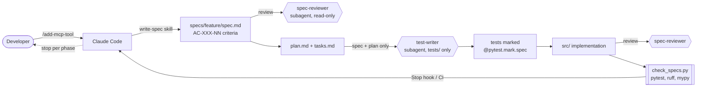

# expense-tracker

A small personal expense tracker exposed as an **MCP server**, built
with Claude Code through a **spec-driven development (SDD)** workflow.

The product is deliberately small. The interesting part is the
process: how the agent is configured, constrained and checked, and
what went wrong along the way. Read the git history in order: every
feature goes `spec:` -> `plan:` -> `tasks:` -> `test:` -> `feat:`.

All data in this repository is fictitious.

## Quick start

```bash
python3 -m venv .venv
.venv/bin/pip install -e ".[dev]"
.venv/bin/pytest
```

No API keys are needed. To use the server from Claude Code, open the
project and approve the `expense-tracker` server from `.mcp.json`
(`/mcp`). The optional `github` server needs `GITHUB_PAT` set to a
fine-grained token; without it, it simply does not connect.

## How the agent works here



| Piece | Where | What it does |
| --- | --- | --- |
| Shared rules | `AGENTS.md` | Commands, domain rule, SDD flow, security, definition of done. Tool-neutral. |
| Claude rules | `CLAUDE.md` | Imports `AGENTS.md`, adds which skill/subagent to use when. |
| Permissions | `.claude/settings.json` | Explicit allow list (no `Bash(*)`); deny `.env*`, `secrets/`, `git push`, `curl`, `rm -rf`. |
| PreToolUse hook | `.claude/hooks/block_secrets.py` | Blocks Bash commands that touch secrets or dump the environment (exit 2). |
| PostToolUse hook | `.claude/hooks/format_python.py` | `ruff format` + `ruff check --fix` on every edited `.py`; reports unfixable lint to the agent. |
| Stop hook | `.claude/hooks/stop_checks.py` | Runs pytest and the spec validator; on failure the agent must keep working (once, to avoid loops). |
| Skill | `.claude/skills/write-spec` | How to write verifiable, ID-tagged acceptance criteria. |
| Skill | `.claude/skills/add-mcp-tool` | The full SDD flow with a commit per phase and STOP points. User-invoked only. |
| Subagent | `.claude/agents/spec-reviewer.md` | Independent, read-only review of a spec or a finished feature. |
| Subagent | `.claude/agents/test-writer.md` | Writes tests from spec + plan, blind to `src/`. |
| Spec validator | `scripts/check_specs.py` | Every AC of an implemented spec has a test; every test mark points to a real AC. |
| MCP | `.mcp.json` | This project's own server (stdio) + GitHub's official server (HTTP). |
| CI | `.github/workflows/ci.yml` | ruff, mypy, pytest, spec validator, gitleaks over the full history. |

### Why these are subagents and not skills

A **skill** is a procedure loaded into the main conversation: it shares
the context and the tools of the agent doing the work. That is right
for `write-spec` and `add-mcp-tool`, which need the conversation with
the user and the full toolset.

A **subagent** runs in its own context with its own tool list. Each of
ours needs that isolation for a concrete reason:

- **spec-reviewer**: a review is only useful if it is independent. In
  the main context the reviewer would share the author's reasoning and
  blind spots. As a subagent it starts from the files, not from the
  author's summary, and has no `Write`/`Edit` tools, so it cannot
  "fix" things quietly instead of reporting them.
- **test-writer**: tests written by someone who has read the code tend
  to assert what the code does, not what the spec asks. A hook in its
  frontmatter (`test_writer_guard.py`) blocks reading `src/` and
  writing outside `tests/`. That restriction is impossible to express
  for a skill, which runs with the main agent's permissions.

A third candidate, a security reviewer, was dropped: finding secrets
is better done by deterministic tools (deny rules, the PreToolUse
hook, gitleaks in CI) than by an LLM.

## Architecture

A monolith with one rule: the domain imports no infrastructure
([ADR 1](docs/adr/0001-functional-core-and-single-llm-port.md)),
enforced by `tests/test_domain_purity.py`.

```
src/expense_tracker/
  domain/     pure rules; Categorizer protocol (the only port)
  adapters/   SQLite storage, fake categorizer
  server.py   MCP tools: parse input -> domain -> storage -> output
```

Decisions: [docs/adr](docs/adr).

## What went wrong and what I learned

Kept up to date as the project goes. Each entry says what happened,
why, and what changed.

1. **The agent picked a non-PEP 8 line length.** The first
   `pyproject.toml` used `line-length = 100`; the developer asked for
   PEP 8. Now: 79/72 columns and pep8-naming in ruff, and PEP 8 is a
   rule in `AGENTS.md`, so it does not depend on the agent's memory.
   Lesson: style preferences that are not written down get replaced
   by the model's defaults.
2. **Near miss: MCP SDK v2 renamed `FastMCP` to `MCPServer`.** The
   agent's habits (and most tutorials) are v1. Checking the current
   docs before coding, and then the installed package's source,
   caught it. `import mcp.server.fastmcp` now fails with a pointer to
   the migration guide.
3. **SDK v2 hides exception messages from tool errors.** A smoke test
   showed `ValueError("amount must be positive")` reaching the client
   as just "Error executing tool add". Only `ToolError` keeps its
   message. Recorded in ADR 3 and in the `add-mcp-tool` skill so the
   plan for every tool includes error mapping.
4. **A hook test that could not fail.** To test the Stop hook, the
   agent created a failing test named `hook_probe_tmp.py`; pytest
   only collects `test_*.py`, so the hook "passed". Lesson: before
   trusting a passing check, see it fail once.
5. **Outdated assumption about `.mcp.json`.** The agent assumed an
   unset `${GITHUB_PAT}` would break the whole file. The current docs
   say the config still loads with a warning for that server only;
   `claude mcp list` confirmed it.
6. **Hooks run before permission rules.** In the live test,
   `cat .env` was stopped by the PreToolUse hook, not by the
   `Read(./.env)` deny rule. Both layers stay (ADR 4), but the order
   matters when reading logs.

7. **The first spec draft was "happy" about edge cases.** The
   agent's draft of `add-expense` had 17 criteria and looked
   complete. The `spec-reviewer` subagent, reading it cold, found 10
   major gaps a test writer would have had to guess about: a JSON
   number like 19.99 becomes a float that `Decimal()` turns into
   19.98999..., `"NaN"` crashes the comparison, `"1e30"` overflows the
   INTEGER column and reaches the client as an opaque error, plus
   undefined trimming, blank optionals, validation order and a
   non-strict date format (`20261001` passes `fromisoformat`). The
   same model that wrote the spec missed all of it; a separate
   context caught it. Business decisions (future dates, max amount,
   comma separator) went to the developer, not to the agent.
8. **Then the reviewer over-split.** Its second pass asked to split
   criteria by code path (`null` vs `""` vs missing), which took the
   spec to 34 criteria. The developer pushed back: many had the same
   outcome. Rule now in `write-spec` and `spec-reviewer`: one
   criterion per observable outcome, listing every example value,
   and tests must cover all values (the reviewer checks that, since
   `check_specs.py` only counts one test per criterion). Result: 23
   criteria. Lesson: a reviewer agent optimises for what its prompt
   rewards; "one behaviour" was read as "one code path".

### Manual hook verification (phase 2)

Done live in a Claude Code session on this repo, besides
`tests/test_hooks.py`:

- `Write .env` -> refused by the `Edit(./.env)` deny rule.
- `cat .env`, `grep TOKEN .env`, `python3 -c "open('.env')"` ->
  blocked by `block_secrets.py` (exit 2, reason shown to the agent).
- Writing a badly formatted `.py` -> reformatted by
  `format_python.py`, unused imports removed.
- Ending a turn with a deliberately failing test -> `stop_checks.py`
  blocked the stop and fed the pytest failure back; the agent removed
  the test and the next stop passed.
